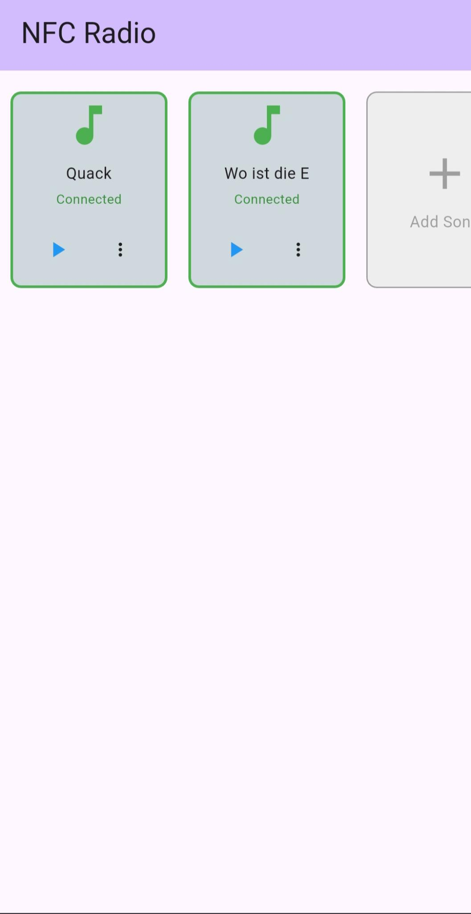
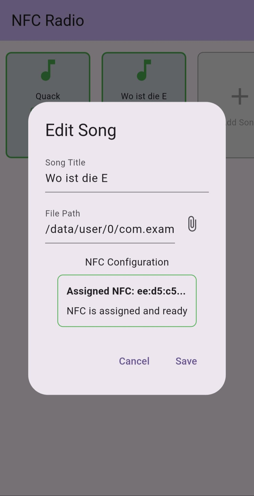
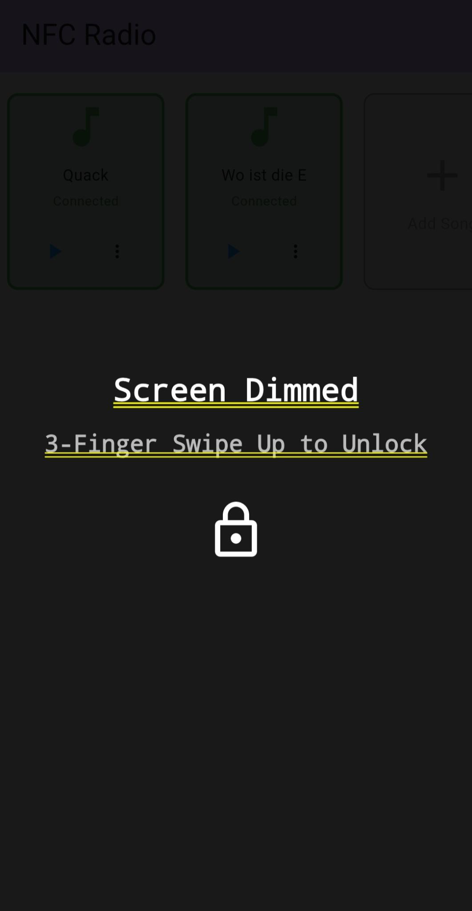

# NFC Radio

This Flutter project is a music player app (mainly for mobile due to the need for NFC) that can be controlled by any NFC tag. There is no information saved on the tag itself, but the tag's ID is used to identify the tag. The app will then use the ID to determine which radio file to play.

I wanted to have a simple-to-use radio that can be used to hear favorite songs or stories without the need for using a screen. NFC tags can be placed in toys or pictures, which can act as a CMI (Child-Machine-Interface) 😉

## Screenshots





App Overview | App Detail | App Lock

## Features

- **NFC Integration**: Control the music player using NFC tags.
- **Simple UI**: Easy-to-use interface for playing music.
- **Customizable**: Map NFC tags to play local audio files.
- **Cross-Platform**: Is tested on Android devices, but might also work on iOS.
- **Privacy Focused**: No data is collected or stored. Everything is stored locally on the device.

## Technologies Used

- **Flutter**: A UI toolkit for building natively compiled applications for mobile, web, and desktop from a single codebase.
- **Dart**: The programming language used for Flutter development.
- **NFC Plugins**: Flutter plugins for NFC functionality.

## Installation

To set up the project locally, follow these steps:

1. **Clone the Repository**:
   ```bash
   git clone https://github.com/trapplab/NFC-Radio.git
   ```

2. **Navigate to the Project Directory**:
   ```bash
   cd NFC-Radio
   ```

3. **Install Dependencies**:
   ```bash
   flutter pub get
   ```

4. **Run the App**:
   ```bash
   flutter run
   ```

## Usage

1. **Setting Up NFC Tags**:
   - Place an NFC tag near your device.
   - The app will read the tag's ID and map it to a specific radio file or playlist.

2. **Playing Music**:
   - Tap the NFC tag to start playing the associated music.
   - Use the app's interface to control playback (play, pause, skip, etc.).

## Contributing

Contributions are welcome! If you'd like to contribute to this project, please follow these steps:

1. Fork the repository.
2. Create a new branch for your feature or bug fix.
3. Make your changes and commit them.
4. Push your changes to your fork.
5. Submit a pull request.

## License

This project is licensed under the MIT License. See the [LICENSE](LICENSE) file for more details.

