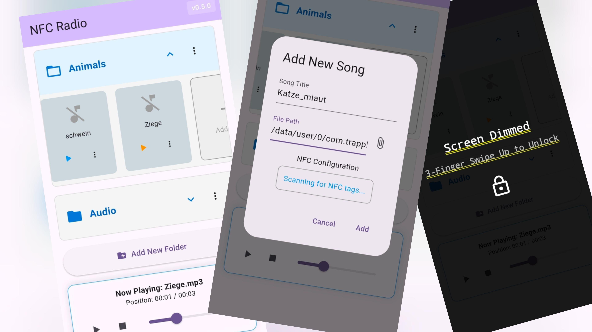

#  NFC Radio

## Available on
[](https://f-droid.org/packages/com.trapplab.nfc_radio/)
[](https://play.google.com/store/apps/details?id=com.trapplab.nfc_radio)
[](https://github.com/trapplab/NFC-Radio/releases)

### Status


## Description
This Flutter project is a music player app (mainly for mobile due to the need for NFC) that can be controlled by any NFC tag. There is no information saved on the tag itself, but the tag's ID is used to identify the tag. The app will then use the ID to determine which radio file to play.

I wanted to have a simple-to-use radio that can be used to hear favorite songs or stories without the need for using a screen. NFC tags can be placed in toys or pictures, which can act as a CMI (Child-Machine-Interface) 😉

## Screenshots



App Overview | App Detail | App Lock

## Features

- **NFC Integration**: Control the music player using NFC tags.
- **Simple UI**: Easy-to-use interface for playing music.
- **Customizable**: Map NFC tags to play local audio files.
- **Cross-Platform**: Is tested on Android devices, but might also work on iOS.
- **Privacy Focused**: No data is collected or stored. Everything is stored locally on the device.

## Get audio test files

A good source to test some audio files I liked is: [https://freeanimalsounds.org/farm-animals/](https://freeanimalsounds.org/farm-animals/)

## Technologies Used

- **Flutter**: A UI toolkit for building natively compiled applications for mobile, web, and desktop from a single codebase.
- **Dart**: The programming language used for Flutter development.
- **NFC Plugins**: Flutter plugins for NFC functionality.

## Installation

To set up the project locally, follow these steps:

1. **Clone the Repository**:
   ```bash
   git clone https://github.com/trapplab/NFC-Radio.git
   ```

2. **Navigate to the Project Directory**:
   ```bash
   cd NFC-Radio
   ```

3. **Install Dependencies**:
   ```bash
   flutter pub get
   ```

4. **Run the App**:
   Running the App
   ```bash
   ./scripts/prepare_flavor.sh fdroid && flutter run --flavor fdroid
   ./scripts/prepare_flavor.sh play && flutter run --flavor play
   ./scripts/prepare_flavor.sh github && flutter run --flavor github 
   ```

4. **Build the App**:
   Build a App Release with 
   ```bash
   # single apk
   ./scripts/prepare_flavor.sh fdroid && flutter build apk --flavor fdroid --split-per-abi --target-platform=android-arm64  --release  
   ./scripts/prepare_flavor.sh play && flutter build apk --flavor play --split-per-abi --target-platform=android-arm64  --release
   ./scripts/prepare_flavor.sh github && flutter build apk --flavor github --split-per-abi --target-platform=android-arm64  --release
   
   # app bundle
   ./scripts/prepare_flavor.sh play && flutter build appbundle --flavor play --release
   ```

## Flavors

The app can be built with three flavors:

- **Github**: Contains all features, checks for updates on the Github release page.
- **F-Droid**: Contains all features, gets updates from the F-Droid store.
- **Google Play**: Limited features, extended features can be unlocked with a purchase. Gets updates from the Google Play Store.

## Usage

1. **Setting Up NFC Tags**:
   - Place an NFC tag near your device.
   - The app will read the tag's ID and map it to a specific radio file or playlist.

2. **Playing Music**:
   - Tap the NFC tag to start playing the associated music.
   - Use the app's interface to control playback (play, pause, skip, etc.).

## Contributing

Contributions are welcome! If you'd like to contribute to this project, please follow these steps:

1. Fork the repository.
2. Create a new branch for your feature or bug fix.
3. Make your changes and commit them.
4. Push your changes to your fork.
5. Submit a pull request.

## Development Setup

This project uses a pre-commit hook to ensure version consistency across `pubspec.yaml`, `pubspec.play.yaml`, and `pubspec.fdroid.yaml`. And check the consistency of the Changelog.md with the changelog files in the fastlane folder. And calls the `update_changelogs_with_translation.sh` script to update the changelog files in the fastlane folders.

To install the hook, run the following command in the project root:

```bash
ln -sf scripts/git-hooks/pre-commit .git/hooks/pre-commit
```

This will ensure that every commit checks for consistent versions in the pubspec files.


## License

This project is licensed under the MIT License. See the [LICENSE](LICENSE) file for more details.