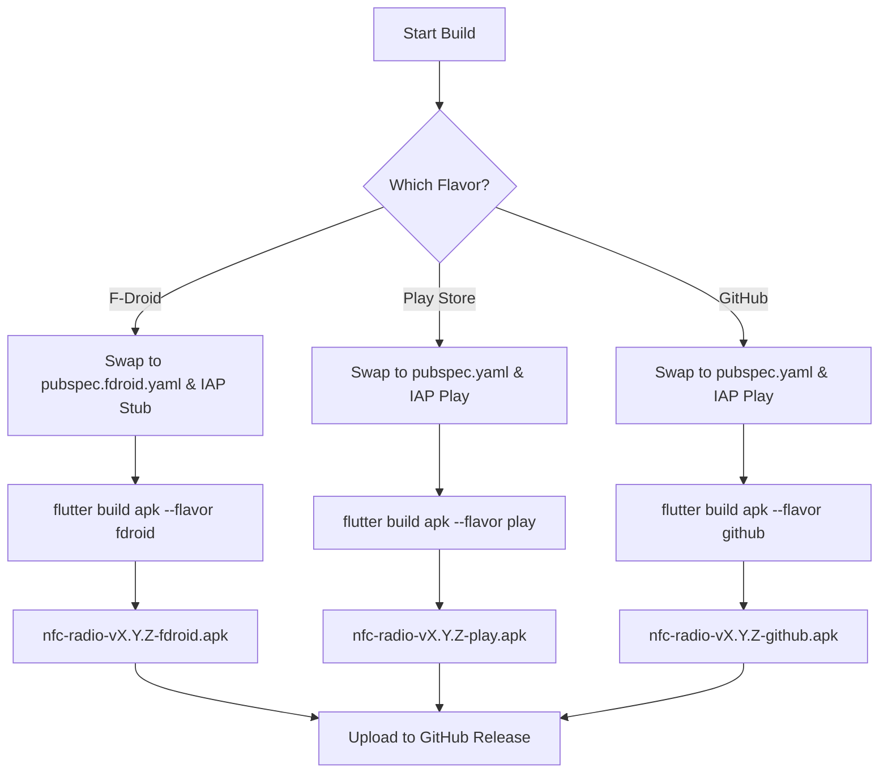

# Plan: Implementing Multi-Flavor Builds (F-Droid, Play Store, GitHub)

This plan outlines the steps to create three distinct build flavors for NFC Radio using Flutter's native flavor support, removing the need for manual `--dart-define` flags for flavor detection.

## 1. Android Configuration (Gradle)

We will define three product flavors in [`android/app/build.gradle.kts`](android/app/build.gradle.kts).

```kotlin
flavorDimensions += "store"
productFlavors {
    create("fdroid") {
        dimension = "store"
        versionNameSuffix = "-fdroid"
    }
    create("play") {
        dimension = "store"
        // No suffix for Play Store
    }
    create("github") {
        dimension = "store"
        versionNameSuffix = "-github"
    }
}
```

## 2. Dependency Management (F-Droid Compliance)

F-Droid requires that no proprietary libraries (like Google Play Billing) are included in the build. We will handle this by:
1.  Creating a [`pubspec.fdroid.yaml`](pubspec.fdroid.yaml) that excludes `in_app_purchase`.
2.  Using a preparation script to swap the `pubspec.yaml` and `IAPService` implementation based on the target flavor.

### File Structure Changes:
- `pubspec.yaml` (Main, used for Play/GitHub)
- `pubspec.fdroid.yaml` (F-Droid specific, no `in_app_purchase`)
- `lib/iap/iap_service.dart` (The interface/entry point)
- `lib/iap/iap_service_play.dart` (Actual implementation)
- `lib/iap/iap_service_stub.dart` (No-op implementation)

## 3. Build Automation Script

A script [`scripts/prepare_flavor.sh`](scripts/prepare_flavor.sh) will be created to swap the necessary files before a build. This script will also generate a `lib/flavor_config.dart` file that contains the flavor name, allowing the app to know its flavor without `--dart-define`.

```bash
#!/bin/bash
FLAVOR=$1

# Generate flavor config
echo "// Generated file. Do not edit.
class FlavorConfig {
  static const String flavor = '$FLAVOR';
  static bool get isFdroid => flavor == 'fdroid';
  static bool get isGithub => flavor == 'github';
  static bool get isPlay => flavor == 'play';
}" > lib/flavor_config.dart

if [ "$FLAVOR" == "fdroid" ] || [ "$FLAVOR" == "github" ]; then
    cp pubspec.fdroid.yaml pubspec.yaml
    cp lib/iap/iap_service_stub.dart lib/iap_service.dart
else
    cp pubspec.play.yaml pubspec.yaml
    cp lib/iap/iap_service_play.dart lib/iap_service.dart
fi
```

## 4. CI/CD Workflow Update

The GitHub Actions workflow will be updated to:
1.  Run the preparation script for each flavor.
2.  Execute `flutter build apk --flavor <flavor>`.
3.  Collect and rename the resulting APKs.
4.  Upload all three APKs to the GitHub Release.

## 5. Dart Code Adjustments

- [`lib/config.dart`](lib/config.dart) will be updated to use `FlavorConfig` instead of `bool.fromEnvironment`.
- [`lib/main.dart`](lib/main.dart) will use `FlavorConfig` to decide whether to initialize IAP or check for updates.

## Mermaid Diagram of the Build Process



## Questions & Considerations
- **Package Name**: Confirmed to keep `com.trapplab.nfc_radio` for all.
- **IAP in GitHub**: Usually, GitHub releases include IAP functionality so users can upgrade if they want, but they can also be "full" versions. The current code sets `isPremium = true` for non-Play flavors, which means GitHub and F-Droid users get everything for free. Is this intended? Yes thats intended.
