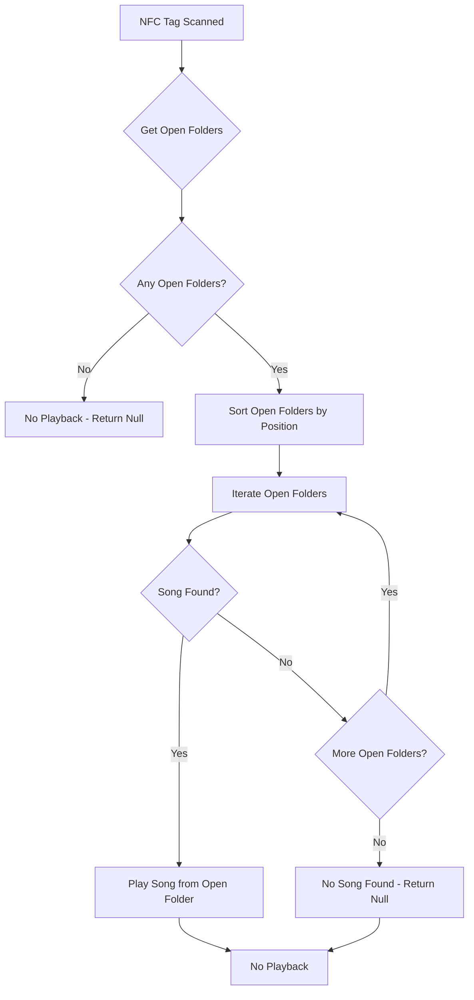

# NFC Multi-Folder Playback Implementation Plan

## Overview
Change NFC tag playback logic to allow playing tags from multiple open folders. Multiple folders can now be opened simultaneously, and only songs in open folders are considered for playback.

## Current Behavior Analysis

### Current NFC Tag Search Logic (`nfc_service.dart` lines 93-137)
- `_findSongByUuid()` only searches within the "open folder" (the one that is expanded)
- Uses `firstWhere((f) => f.isExpanded)` to find the open folder
- Falls back to first folder if none is expanded

### Current Folder Expansion Logic (`folder.dart` lines 313-345)
- `toggleFolderExpansion()` collapses all folders and only expands the clicked one
- This enforces single-folder-open behavior

### All Folders Closed Check (`nfc_service.dart` lines 201-214, 262-269)
- `_areAllFoldersClosed()` checks if all folders are closed
- If all folders are closed, NFC playback is blocked

## New Requirements

1. **Multiple folders can be opened** - Remove single-folder restriction
2. **Only open folders are searched for NFC playback** - Closed folders are NOT considered
3. **Priority logic**: If two songs are assigned to the same tag in different open folders, the tag in the highest open folder shall be played first
4. **Old unneeded code shall be removed**
5. **Old db entries shall not break by this update**
6. **Folder expansion state shall be preserved across app restarts**

## Implementation Plan

### 1. Modify `lib/storage/folder.dart`

#### Remove folder collapse on initialization (lines 194-208)
**Current behavior**: All folders are collapsed on app startup
**New behavior**: Folders retain their expansion state from the database

Remove the code block that collapses all folders during initialization:

```dart
// REMOVE THIS BLOCK (lines 194-208):
// Collapse all folders by default on initialization
if (_folders.isNotEmpty) {
  for (int i = 0; i < _folders.length; i++) {
    _folders[i] = Folder(
      id: _folders[i].id,
      name: _folders[i].name,
      songIds: _folders[i].songIds,
      isExpanded: false,
      position: _folders[i].position,
    );
  }
  debugPrint('📁 All folders collapsed by default');
}
```

The `isExpanded` property is already persisted in the database (it's a `@HiveField(3)`), so removing this code will allow folders to retain their expansion state across app restarts.

#### Change `toggleFolderExpansion()` method (lines 313-345)
**Current behavior**: Collapses all folders, then expands the clicked one
**New behavior**: Simply toggles the clicked folder's expansion state

**Important Note**: The expansion state must now be persisted to storage (not kept in memory only) so it can be restored on app restart.

```dart
void toggleFolderExpansion(String folderId) {
  final folderIndex = _folders.indexWhere((folder) => folder.id == folderId);
  if (folderIndex != -1) {
    // Simply toggle the expansion state of the clicked folder
    final updatedFolder = Folder(
      id: _folders[folderIndex].id,
      name: _folders[folderIndex].name,
      songIds: _folders[folderIndex].songIds,
      isExpanded: !_folders[folderIndex].isExpanded, // Toggle only this folder
      position: _folders[folderIndex].position,
    );
    _folders[folderIndex] = updatedFolder;
    
    // Persist the expansion state to storage
    _saveFolderToStorage(updatedFolder);
    
    notifyListeners();
  }
}
```

### 2. Modify `lib/nfc/nfc_service.dart`

#### Change `_findSongByUuid()` method (lines 93-137)
**Current behavior**: Searches only in the open folder
**New behavior**: Searches across all open folders with priority logic

**Priority Logic Definition**:
- "Highest open folder" means the folder with the **lowest `position` value** (position 0 is at the top of the list)
- Only open folders are searched (closed folders are NOT considered)
- Open folders are sorted by position in ascending order (0, 1, 2, ...)
- The first match found is returned immediately (no need to search further)

**Edge Cases Handled**:
- Song ID exists in a folder but not in SongProvider (caught and skipped with try-catch)
- Multiple open folders have the same NFC tag assigned to different songs (priority determines which plays)
- No folders are open (returns null, no playback occurs)
- No songs in open folders match the NFC UUID (returns null, no playback occurs)

**Example Scenario**:
```
Folder A (position 0, open): Song X with NFC tag "abc"
Folder B (position 1, open): Song Y with NFC tag "abc"
Folder C (position 2, closed): Song Z with NFC tag "abc"

When NFC tag "abc" is scanned:
1. Search Folder A (open, position 0) -> Found Song X -> Play Song X
```

```dart
// Find song by NFC UUID with priority logic (only searches open folders)
Song? _findSongByUuid(String uuid) {
  if (_songProvider == null || _folderProvider == null) {
    debugPrint('SongProvider or FolderProvider is null');
    return null;
  }
  
  debugPrint('Searching for UUID: $uuid');
  
  // Get only open folders
  final List<Folder> openFolders = _folderProvider!.folders.where((f) => f.isExpanded).toList();
  
  // Sort open folders by position (highest first = lowest position value)
  openFolders.sort((a, b) => a.position.compareTo(b.position));
  
  // Search in open folders (highest position first)
  for (final folder in openFolders) {
    for (String songId in folder.songIds) {
      try {
        final song = _songProvider!.songs.firstWhere((s) => s.id == songId);
        if (song.connectedNfcUuid == uuid) {
          debugPrint('Found song in open folder (position ${folder.position}): ${song.title}');
          return song; // Return immediately - highest priority
        }
      } catch (_) {
        // Song ID in folder but not in SongProvider - skip
      }
    }
  }
  
  debugPrint('No song found for UUID: $uuid in open folders');
  return null;
}
```

#### Remove or modify `_areAllFoldersClosed()` check (lines 201-214, 262-269)
**Option 1**: Remove the check entirely - allow playback from any folder
**Option 2**: Keep the check but only show a warning, don't block playback

I recommend **Option 1** - remove the check entirely since the new requirement is to allow playback from all open folders.

**Remove lines 201-214** (the `_areAllFoldersClosed()` method)

**Remove lines 262-269** (the check in `_processNfcTag()`)

### 3. Update NFC conflict resolution logic in `lib/main.dart`

#### Update song dialog NFC conflict handling (lines 987-1016, 1195-1259)
**Current behavior**: Only checks for conflicts within the same folder
**New behavior**: Check for conflicts across all folders, but only warn about conflicts in open folders

The current logic already checks within the same folder only, which is correct for the new behavior. However, we should update the user message to clarify that conflicts are only checked within the same folder.

**No changes needed** - the current behavior is already correct for the new multi-folder system.

### 4. Database Compatibility

The existing database structure does not need to change:
- `NFCMusicMapping` already supports multiple songs with the same NFC UUID (uses songId as key)
- `Folder` already has `isExpanded` property (persisted as `@HiveField(3)`)
- `Song` already has `connectedNfcUuid` property

Old database entries will continue to work because:
1. The mapping structure is unchanged
2. The folder structure is unchanged
3. Only the search logic is modified

## Summary of Changes

| File | Method | Change Type | Description |
|------|--------|-------------|-------------|
| `lib/storage/folder.dart` | `initialize()` | Modify | Remove code that collapses all folders on startup (preserve expansion state) |
| `lib/storage/folder.dart` | `toggleFolderExpansion()` | Modify | Allow multiple folders to be expanded and persist state |
| `lib/nfc/nfc_service.dart` | `_findSongByUuid()` | Modify | Search across all open folders with priority logic (closed folders NOT searched) |
| `lib/nfc/nfc_service.dart` | `_areAllFoldersClosed()` | Remove | Remove the all-folders-closed check |
| `lib/nfc/nfc_service.dart` | `_processNfcTag()` | Modify | Remove the all-folders-closed check call |

## Testing Checklist

- [ ] Multiple folders can be opened simultaneously
- [ ] NFC tags from closed folders are NOT played (only open folders are searched)
- [ ] When the same NFC tag is assigned to songs in multiple open folders, the song in the highest open folder plays first
- [ ] When no folders are open, NFC tags do not play
- [ ] Old database entries continue to work
- [ ] Folder expansion/collapse works correctly
- [ ] NFC conflict resolution in song dialog still works correctly
- [ ] Folder expansion state is preserved across app restarts (folders that were open when app closed are still open on next launch)

## Mermaid Diagram: New NFC Tag Search Flow


